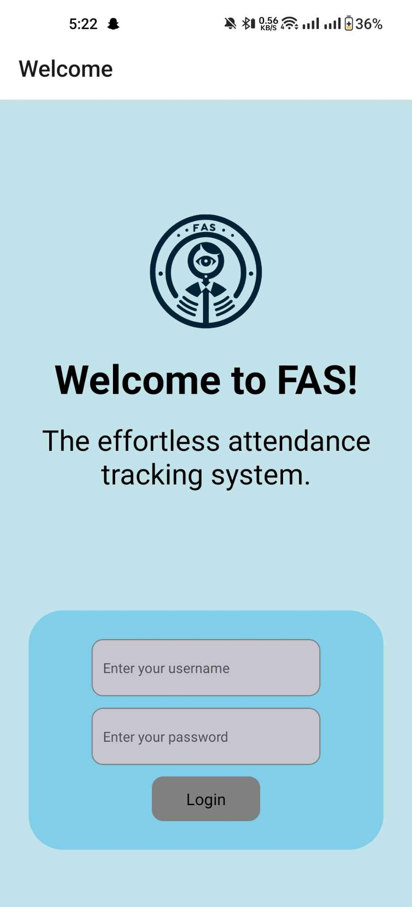

# Facial Recognition Automatic Class Attendance System (FAS)

Facial Recognition Automatic Class Attendance System (FAS) is a project developed using React Native that aims to revolutionize attendance management in educational institutions. By leveraging facial recognition technology, FAS eliminates the need for manual processes and provides a real-time, efficient, and secure solution for attendance management.

*Figure 1: Welcome Screen*

*Figure 1: Welcome Screen*

## Features

- Automatic recognition and recording of students' attendance in real-time
- User-friendly web-based application for easy management
- Trained machine learning models for accurate facial recognition
- Real-time attendance tracking and digital attendance records
- Comprehensive reporting and analytics for attendance trends
- Integration with existing infrastructure for seamless deployment
- Robust security measures to ensure data privacy

## Technology Stack

- Frontend: React Native, ReactJS
- Backend: Node.js
- Database: MongoDB
- Facial Detection and Landmark Detection: MTCNN algorithm
- Face Embeddings: InsightFace model
- Model Training: Keras with a dense neural network architecture

## Installation Steps

To set up the Facial Recognition Automatic Class Attendance System, follow these steps:

1. Clone the repository from GitHub: https://github.com/raazkhnl/fas_mob_v1
2. Install the required dependencies using the package manager of your choice.

Frontend:

    pip install
    npm expo start

Install expo go an scan QR to view.

#### TODO
3. Set up the backend server by navigating to the backend directory and running the necessary commands.
4. Configure the database management system with the required credentials.
5. Configure the frontend environment by updating the necessary configuration files.
6. Train the facial recognition model using the provided dataset or your own dataset.
7. Deploy the application to your desired platform or server.
8. Access the web-based application and start managing attendance effortlessly.

## Usage

Once the Facial Recognition Automatic Class Attendance System is installed and set up, follow these steps to use the system:

1. Launch the web-based application and log in as an administrator.
2. Configure the necessary settings, such as class schedules and subjects.
3. Train the facial recognition model with student images.
4. Start a class session, and the system will automatically recognize and record students' attendance.
5. Monitor attendance records, generate reports, and analyze attendance trends through the application's dashboard.
6. Access attendance data in real-time and export it for further analysis or integration with other systems.

## Contributions

Contributions to the Facial Recognition Automatic Class Attendance System are welcome. If you would like to contribute, please follow these steps:

1. Fork the repository from GitHub.
2. Create a new branch for your feature or bug fix.
3. Implement your changes and ensure that the codebase is well-tested.
4. Commit and push your changes to your forked repository.
5. Submit a pull request, explaining the purpose and scope of your changes.

We appreciate your contributions and look forward to improving the Facial Recognition Automatic Class Attendance System together.

## License

The Facial Recognition Automatic Class Attendance System is licensed under the [License Name] license. Please refer to the LICENSE file for more information.